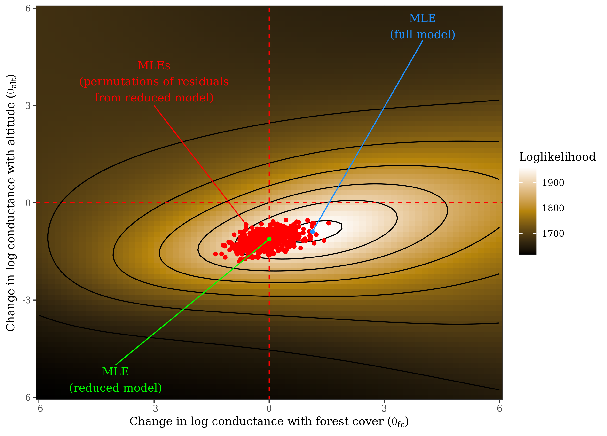

# radish

Fast gradient-based optimization of resistance surfaces.

`radish` is an R package for maximum likelihood estimation of isolation-by-resistance models, where conductance is a function of spatial covariates, the observed data are genetic distances, and the likelihood of the "measurement process" is cheap to compute (e.g. regression of distance matrices, or generalized Wishart). It also provides fast computation of the gradient, Hessian matrix, and derivative-based leverage/influence measures. As currently implemented it is intended for moderate-sized problems (e.g. rasters with less than 1mil cells, where a sparse Choleski decomposition is feasible). Larger problems are possible (with sufficient memory), but slow.

Slides from a recent workshop can be found [here](https://github.com/nspope/radish-manuscript/raw/master/IALE_Wrkshp_Pope_Final.pdf).



Requires [corMLPE](https://github.com/nspope/corMLPE): `devtools::install_github("nspope/corMLPE")`. Other dependencies are available through CRAN. Install `radish` via `devtools::install_github("nspope/radish")`.

This is a work-in-progress and the interface/methods may change suddenly. Contact at nspope at utexas dot edu.

# Worked example

```r
library(radish)
library(raster)

data(melip)

# scaling spatial covariates helps avoid numeric overflow
covariates <- raster::stack(list(altitude = raster::scale(melip.altitude), 
                                 forestcover = raster::scale(melip.forestcover)))

plot(covariates[["altitude"]])
points(melip.coords, pch = 19)

surface <- conductance_surface(~forestcover + altitude, covariates, melip.coords, directions = 8)

fit_nnls <- radish(radish::loglinear_conductance, radish::leastsquares, surface, melip.Fst)
summary(fit_nnls)

# refit with with a different measurement model that models
# dependence among pairwise measurements (radish::mlpe)
fit_mlpe <- radish(radish::loglinear_conductance, radish::mlpe, surface, melip.Fst)
summary(fit_mlpe)

plot(fitted(fit_mlpe, "distance"), melip.Fst, pch = 19,
     xlab = "Optimized resistance distance", ylab = "Fst")

# visualise estimated conductance surface and asymptotic confidence intervals
fitted_conductance <- conductance(surface, fit_mlpe, quantile = 0.95)
plot(fitted_conductance[["est"]], main = "Fitted conductance surface\n(forestcover + altitude)")
plot(fitted_conductance[["lower95"]], main = "Fitted conductance surface\n(lower 95% CI)")
plot(fitted_conductance[["upper95"]], main = "Fitted conductance surface\n(upper 95% CI)")

# visualise likelihood surface across grid for reduced model (takes awhile)
theta <- as.matrix(expand.grid(forestcover=seq(-1,1,length.out=21), altitude=seq(-1,1,length.out=21)))
grid <- radish_grid(radish::loglinear_conductance, radish::mlpe, surface, melip.Fst, theta)

library(ggplot2)
ggplot(data.frame(loglik=grid$loglik, grid$theta), aes(x=forestcover, y=altitude)) + 
  geom_tile(aes(fill=-loglik)) + 
  geom_contour(aes(z=-loglik), color="black") +
  theme_bw() +
  xlab(expression(theta[altitude])) +
  ylab(expression(theta[forestcover]))

# calculate resistance distances across grid
distances <- radish_distance(radish::loglinear_conductance, surface, theta)

ibd <- which(theta[,1] == 0 & theta[,2] == 0)
plot(distances$distance[,,ibd], melip.Fst, pch = 19, 
     xlab = "Null resistance distance (IBD)", ylab = "Fst")

# fit a reduced model without "forestcover" covariate, and compare to 
# full model via a likelihood ratio test
surface_reduced <- downdate(surface, ~ . - forestcover)
fit_mlpe_reduced <- radish(radish::loglinear_conductance, radish::mlpe, surface_reduced, melip.Fst)
anova(fit_mlpe, fit_mlpe_reduced)

# compute negative loglikelihood, gradient, Hessian for a given choice of
# of the conductance parameters theta, using a different measurement model
# (radish::generalized_wishart)
radish_algorithm(radish::loglinear_conductance, radish::generalized_wishart, surface, 
                 pmax(melip.Fst, 0), nu = 1000, theta = c(-0.3, 0.3), 
                 gradient = TRUE, hessian = TRUE)$hessian
# numerical verification (not run)
#numDeriv::hessian(function(x)
#     radish_algorithm(radish::loglinear_conductance, radish::generalized_wishart, surface, 
#                      pmax(melip.Fst, 0), nu = 1000, theta = x)$objective,
#                  c(-0.3, 0.3))
```
 
# RStan hooks
In progress
